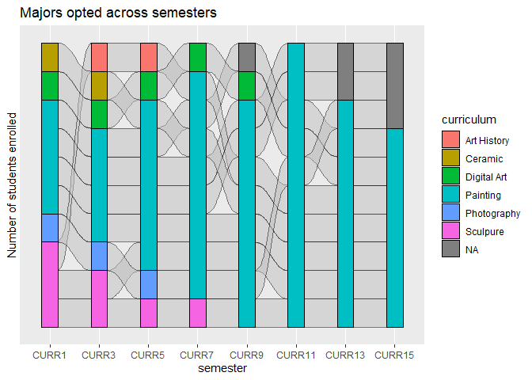
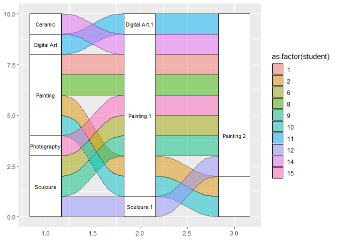

Alluvial Diagram
================

``` r
pacman::p_load(
        tidyverse,  # data management and visualization
        ggalluvial  # generate alluvial diagram
)
```

### Import data

``` r
data("majors")
majors %>% tibble()
```

    ## # A tibble: 80 × 3
    ##    student semester curriculum 
    ##      <int> <fct>    <chr>      
    ##  1       1 CURR1    Painting   
    ##  2       2 CURR1    Painting   
    ##  3       6 CURR1    Sculpure   
    ##  4       8 CURR1    Painting   
    ##  5       9 CURR1    Sculpure   
    ##  6      10 CURR1    Painting   
    ##  7      11 CURR1    Digital Art
    ##  8      12 CURR1    Sculpure   
    ##  9      14 CURR1    Ceramic    
    ## 10      15 CURR1    Photography
    ## # ℹ 70 more rows

### Data overview

Data of 10 students and their majors across 8 semesters.

``` r
majors %>% count(student)
```

    ##    student n
    ## 1        1 8
    ## 2        2 8
    ## 3        6 8
    ## 4        8 8
    ## 5        9 8
    ## 6       10 8
    ## 7       11 8
    ## 8       12 8
    ## 9       14 8
    ## 10      15 8

``` r
majors %>% count(semester)
```

    ##   semester  n
    ## 1    CURR1 10
    ## 2    CURR3 10
    ## 3    CURR5 10
    ## 4    CURR7 10
    ## 5    CURR9 10
    ## 6   CURR11 10
    ## 7   CURR13 10
    ## 8   CURR15 10

``` r
majors %>% count(curriculum)
```

    ##    curriculum  n
    ## 1 Art History  2
    ## 2     Ceramic  2
    ## 3 Digital Art  5
    ## 4    Painting 55
    ## 5 Photography  3
    ## 6    Sculpure  7
    ## 7        <NA>  6

### Check lodes_form

``` r
majors %>% is_lodes_form(key = semester,
                         value = curriculum,
                         id = "student")
```

    ## [1] TRUE

Alluvial plot

``` r
majors %>% ggplot(aes(alluvium = student,
                      x = semester,
                      stratum = curriculum)) +
       # geom_alluvium(color = "black") +
        geom_stratum(aes(fill = curriculum),
                     color = "black") +
        scale_y_discrete(breaks = seq(1, 10, by = 1)) +
        labs(y = "Number of students enrolled",
             title = "Majors opted across semesters")
```

<!-- -->

### Check alluvial_form

``` r
(majors_alluvia <- majors %>% 
        to_alluvia_form(key = semester,
                        value = curriculum,
                        id = student) %>%
        tibble())
```

    ## # A tibble: 10 × 9
    ##    student CURR1       CURR3       CURR5       CURR7       CURR9 CURR11 CURR13 CURR15
    ##      <int> <chr>       <chr>       <chr>       <chr>       <chr> <chr>  <chr>  <chr> 
    ##  1       1 Painting    Painting    Painting    Painting    Pain… Paint… Paint… Paint…
    ##  2       2 Painting    Painting    Painting    Painting    Pain… Paint… <NA>   <NA>  
    ##  3       6 Sculpure    Sculpure    Painting    Painting    Pain… Paint… Paint… Paint…
    ##  4       8 Painting    Painting    Painting    Painting    <NA>  Paint… Paint… Paint…
    ##  5       9 Sculpure    Art History Art History Painting    Pain… Paint… Paint… Paint…
    ##  6      10 Painting    Painting    Painting    Painting    Pain… Paint… <NA>   <NA>  
    ##  7      11 Digital Art Digital Art Digital Art Digital Art Digi… Paint… Paint… Paint…
    ##  8      12 Sculpure    Sculpure    Sculpure    Sculpure    Pain… Paint… Paint… Paint…
    ##  9      14 Ceramic     Ceramic     Painting    Painting    Pain… Paint… Paint… Paint…
    ## 10      15 Photography Photography Photography Painting    Pain… Paint… Paint… <NA>

Alluvial plot

``` r
majors_alluvia %>% ggplot(aes(axis1 = CURR1,
                              axis2 = CURR7,
                              axis3 = CURR13)) +
        geom_alluvium(aes(fill = as.factor(student)),
                      color = "black") +
        geom_stratum() +
        geom_text(aes(label = after_stat(stratum)),
                  stat = "stratum",
                  size = 3,
                  discern = TRUE)
```

    ## Warning in to_lodes_form(data = data, axes = axis_ind, discern = params$discern):
    ## Some strata appear at multiple axes.

    ## Warning in to_lodes_form(data = data, axes = axis_ind, discern = params$discern):
    ## Some strata appear at multiple axes.

<!-- -->

``` r
#rmarkdown::render()
```
