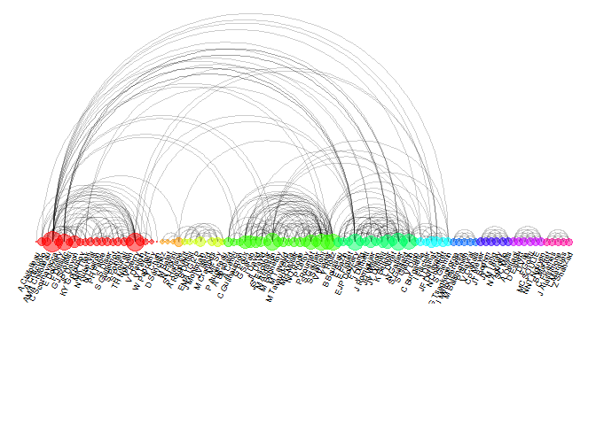

ARC diagram — example co-authorship network of a researcher
================
trucl
2024-06-15

``` r
pacman::p_load(
        rio,            # import and export files
        here,           # locate files 
        tidyverse,      # data management and visualization
        igraph,
        ggraph
)
```

### Data

``` r
data_url <- "https://raw.githubusercontent.com/holtzy/data_to_viz/master/Example_dataset/13_AdjacencyUndirectedUnweighted.csv"
data_raw <- rio::import(data_url, header = TRUE)

data_raw %>% tibble()
```

    ## # A tibble: 118 × 109
    ##    from       `A Bateman` `A Besnard` `A Breil` `A Cenci` `A Criscuolo` `A Dassouli`
    ##    <chr>            <int>       <int>     <int>     <int>         <int>        <int>
    ##  1 A Armero            NA          NA         1        NA            NA           NA
    ##  2 A Bateman           NA          NA        NA        NA            NA           NA
    ##  3 A Besnard           NA          NA        NA        NA            NA           NA
    ##  4 A Breil             NA          NA        NA        NA            NA           NA
    ##  5 A Cenci             NA          NA        NA        NA            NA           NA
    ##  6 A Chifoll…          NA          NA        NA        NA            NA           NA
    ##  7 A Criscuo…          NA          NA        NA        NA            NA           NA
    ##  8 A Dassouli          NA          NA        NA        NA            NA           NA
    ##  9 A Dellagi           NA          NA        NA        NA            NA           NA
    ## 10 A Dereeper          NA          NA        NA        NA            NA           NA
    ## # ℹ 108 more rows
    ## # ℹ 102 more variables: `A Dellagi` <int>, `A Dereeper` <int>, `A Regnault` <int>,
    ## #   `AMA Chifolleau` <int>, `B Boussau` <int>, `B Martret` <int>, `B Noel` <int>,
    ## #   `B Roure` <int>, `B Vacherie` <int>, `C Abessolo` <int>, `C Burgarella` <int>,
    ## #   `C Douady` <int>, `C Fizames` <int>, `C Guilhaumon` <int>,
    ## #   `C Scornavacca` <int>, `CP Meyer` <int>, `CW Kilpatrick` <int>,
    ## #   `D Baurain` <int>, `D Durand` <int>, `D Expert` <int>, `D Pot` <int>, …

### Transform the adjacency matrix in a long format

``` r
(connect <- data_raw %>%
        pivot_longer(cols = -from,
                     names_to = "to",
                     values_to = "value") %>%
        drop_na(value))
```

    ## # A tibble: 405 × 3
    ##    from      to           value
    ##    <chr>     <chr>        <int>
    ##  1 A Armero  A Breil          1
    ##  2 A Armero  A Dereeper       1
    ##  3 A Armero  F De Lamotte     1
    ##  4 A Armero  FC Baurens       1
    ##  5 A Armero  G Droc           1
    ##  6 A Armero  S Bocs           1
    ##  7 A Bateman D Durand         1
    ##  8 A Bateman T Lengauer       1
    ##  9 A Bateman UK Hinxton       1
    ## 10 A Bateman Y Moreau         1
    ## # ℹ 395 more rows

### Number of connection per person

``` r
(coauth <- c(connect$from, connect$to) %>%
        as_tibble() %>%
        group_by(value) %>%
        summarise(n = n()) %>%
        rename(name = value))
```

    ## # A tibble: 133 × 2
    ##    name             n
    ##    <chr>        <int>
    ##  1 A Armero         6
    ##  2 A Bateman        5
    ##  3 A Besnard        6
    ##  4 A Breil          6
    ##  5 A Cenci          4
    ##  6 A Chifolleau     1
    ##  7 A Criscuolo      5
    ##  8 A Dassouli       4
    ##  9 A Dellagi        5
    ## 10 A Dereeper       6
    ## # ℹ 123 more rows

### Create igraph object

``` r
(net_igraph <- graph_from_data_frame(d = connect,
                                     vertices = coauth,
                                     directed = FALSE))
```

    ## IGRAPH ba09f8d UN-- 133 405 -- 
    ## + attr: name (v/c), n (v/n), value (e/n)
    ## + edges from ba09f8d (vertex names):
    ##  [1] A Armero    --A Breil       A Armero    --A Dereeper   
    ##  [3] A Armero    --F De Lamotte  A Armero    --FC Baurens   
    ##  [5] A Armero    --G Droc        A Armero    --S Bocs       
    ##  [7] A Bateman   --D Durand      A Bateman   --T Lengauer   
    ##  [9] A Bateman   --UK Hinxton    A Bateman   --Y Moreau     
    ## [11] A Besnard   --G Poux        A Besnard   --P Leroy      
    ## [13] A Besnard   --P Roumet      A Besnard   --V Viader     
    ## [15] A Breil     --A Dereeper    A Breil     --F De Lamotte 
    ## + ... omitted several edges

### Find community

``` r
(community <- cluster_walktrap(net_igraph))
```

    ## IGRAPH clustering walktrap, groups: 19, mod: 0.73
    ## + groups:
    ##   $`1`
    ##    [1] "A Chifolleau"   "A Criscuolo"    "AMA Chifolleau" "C Scornavacca" 
    ##    [5] "E Douzery"      "F Delsuc"       "GJ Szöllősi"    "JP Doyon"      
    ##    [9] "KY Gorbunov"    "MK Tilak"       "N Auberval"     "N Clairon"     
    ##   [13] "PH Fabre"       "S Diser"        "S Guillemot"    "S Pointet"     
    ##   [17] "S Pourali"      "TH Nguyen"      "V Berry"        "V Daubin"      
    ##   [21] "V Lefort"       "W Paprotny"     "Y Chan"        
    ##   
    ##   $`2`
    ##   [1] "D Sánchez" "M Batet"   "N Fiorini" "S Harispe"
    ##   + ... omitted several groups/vertices

### Reorder dataset + make graph

``` r
(coauth <- coauth %>% 
        mutate(grp = community$membership) %>%
        arrange(grp) %>%
        mutate(name = factor(name, name)))
```

    ## # A tibble: 133 × 3
    ##    name               n   grp
    ##    <fct>          <int> <dbl>
    ##  1 A Chifolleau       1     1
    ##  2 A Criscuolo        5     1
    ##  3 AMA Chifolleau     5     1
    ##  4 C Scornavacca     32     1
    ##  5 E Douzery          4     1
    ##  6 F Delsuc          20     1
    ##  7 GJ Szöllősi        4     1
    ##  8 JP Doyon          11     1
    ##  9 KY Gorbunov        4     1
    ## 10 MK Tilak           4     1
    ## # ℹ 123 more rows

``` r
# keep only 10 first communities
(coauth_10com <- coauth %>% 
        filter(grp < 11))
```

    ## # A tibble: 98 × 3
    ##    name               n   grp
    ##    <fct>          <int> <dbl>
    ##  1 A Chifolleau       1     1
    ##  2 A Criscuolo        5     1
    ##  3 AMA Chifolleau     5     1
    ##  4 C Scornavacca     32     1
    ##  5 E Douzery          4     1
    ##  6 F Delsuc          20     1
    ##  7 GJ Szöllősi        4     1
    ##  8 JP Doyon          11     1
    ##  9 KY Gorbunov        4     1
    ## 10 MK Tilak           4     1
    ## # ℹ 88 more rows

``` r
# keep only people 10 first communities in edges
(connect_10com <- connect %>%
        filter(from %in% coauth_10com$name) %>%
        filter(to %in% coauth_10com$name))
```

    ## # A tibble: 329 × 3
    ##    from         to            value
    ##    <chr>        <chr>         <int>
    ##  1 A Besnard    G Poux            1
    ##  2 A Besnard    P Leroy           1
    ##  3 A Besnard    P Roumet          1
    ##  4 A Besnard    V Viader          1
    ##  5 A Cenci      C Guilhaumon      1
    ##  6 A Cenci      S Santoni         1
    ##  7 A Chifolleau V Berry           1
    ##  8 A Criscuolo  C Scornavacca     1
    ##  9 A Criscuolo  EJP Douzery       1
    ## 10 A Criscuolo  PH Fabre          1
    ## # ℹ 319 more rows

``` r
# Create a graph object with igraph
(net_graph_10com <- graph_from_data_frame(d = connect_10com,
                                         vertices = coauth_10com,
                                         directed = FALSE ))
```

    ## IGRAPH ba2d24e UN-- 98 329 -- 
    ## + attr: name (v/c), n (v/n), grp (v/n), value (e/n)
    ## + edges from ba2d24e (vertex names):
    ##  [1] A Besnard     --G Poux        A Besnard     --P Leroy      
    ##  [3] A Besnard     --P Roumet      A Besnard     --V Viader     
    ##  [5] A Cenci       --C Guilhaumon  A Cenci       --S Santoni    
    ##  [7] A Chifolleau  --V Berry       A Criscuolo   --C Scornavacca
    ##  [9] A Criscuolo   --EJP Douzery   A Criscuolo   --PH Fabre     
    ## [11] A Criscuolo   --S Guillemot   A Dellagi     --D Expert     
    ## [13] A Dellagi     --F Gosti       A Regnault    --M Crampes    
    ## [15] AMA Chifolleau--JP Doyon      AMA Chifolleau--V Berry      
    ## + ... omitted several edges

``` r
# prepare vector of n color in viridis scale
(colors <- rainbow(n = max(coauth_10com$grp)))
```

    ##  [1] "#FF0000" "#FF9900" "#CCFF00" "#33FF00" "#00FF66" "#00FFFF" "#0066FF" "#3300FF"
    ##  [9] "#CC00FF" "#FF0099"

``` r
# Make the graph
ggraph(net_graph_10com, layout = "linear") +
  geom_edge_arc(edge_colour = "black",
                edge_alpha = 0.2,
                edge_width = 0.3,
                fold = TRUE) +
  geom_node_point(aes(size = n,
                      color = as.factor(grp),
                      fill = grp),
                  alpha = 0.5) +
  scale_size_continuous(range = c(0.5, 8)) +
  scale_color_manual(values = colors) +
  geom_node_text(aes(label = name),
                 angle = 65,
                 hjust = 1,
                 nudge_y = -1.1,
                 size = 2.3) +
  theme_void() +
  theme(legend.position = "none",
        plot.margin = unit(c(0, 0, 0.4, 0), "null"),
        panel.spacing = unit(c(0, 0, 3.4, 0), "null")) +
  expand_limits(x = c(-1.2, 1.2),
                y = c(-5.6, 1.2))
```

<!-- -->

``` r
# rmarkdown::render()
```
