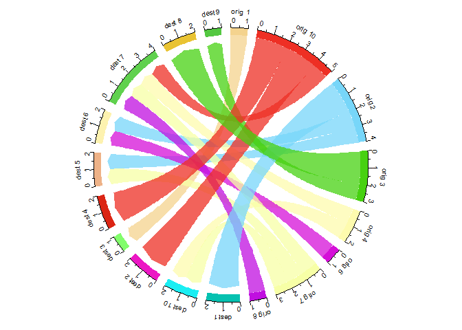

Chord Diagram
================
trucl
2024-06-15

``` r
pacman::p_load(
        rio,            # import and export files
        here,           # locate files 
        tidyverse,      # data management and visualization
        igraph,
        tidygraph,
        ggraph,
        circlize,
        chorddiag
        )

# Install package `chorddiag`
# devtools::install_github("mattflor/chorddiag")
```

## Data

``` r
# data #--------------------------------

# create example edge list
(origin <- paste0("orig ", sample(c(1:10), 20, replace = T)))
```

    ##  [1] "orig 10" "orig 2"  "orig 7"  "orig 3"  "orig 10" "orig 10" "orig 10" "orig 3" 
    ##  [9] "orig 6"  "orig 1"  "orig 4"  "orig 7"  "orig 8"  "orig 2"  "orig 4"  "orig 2" 
    ## [17] "orig 7"  "orig 10" "orig 2"  "orig 3"

``` r
(destination <- paste0("dest ", sample(c(1:10), 20, replace = T)))
```

    ##  [1] "dest 2"  "dest 6"  "dest 10" "dest 8"  "dest 4"  "dest 2"  "dest 4"  "dest 9" 
    ##  [9] "dest 6"  "dest 3"  "dest 7"  "dest 7"  "dest 7"  "dest 1"  "dest 10" "dest 5" 
    ## [17] "dest 5"  "dest 7"  "dest 1"  "dest 8"

``` r
(data <- data.frame(origin, destination))
```

    ##     origin destination
    ## 1  orig 10      dest 2
    ## 2   orig 2      dest 6
    ## 3   orig 7     dest 10
    ## 4   orig 3      dest 8
    ## 5  orig 10      dest 4
    ## 6  orig 10      dest 2
    ## 7  orig 10      dest 4
    ## 8   orig 3      dest 9
    ## 9   orig 6      dest 6
    ## 10  orig 1      dest 3
    ## 11  orig 4      dest 7
    ## 12  orig 7      dest 7
    ## 13  orig 8      dest 7
    ## 14  orig 2      dest 1
    ## 15  orig 4     dest 10
    ## 16  orig 2      dest 5
    ## 17  orig 7      dest 5
    ## 18 orig 10      dest 7
    ## 19  orig 2      dest 1
    ## 20  orig 3      dest 8

## `chorddiag` package: Chord Diagram from Edge List

``` r
# chorddiag pkg #--------------------

data_matrix <- as.matrix(as_adjacency_matrix(as_tbl_graph(data)))

chorddiag(data = data_matrix,
          groupnamePadding = 30,
          groupPadding = 3,
          groupColors = c("#ffffe5",
                          "#fff7bc",
                          "#fee391",
                          "#fec44f",
                          "#fe9929",
                          "#ec7014",
                          "#cc4c02",
                          "#8c2d04"),
          groupnameFontsize = 13 ,
          showTicks = FALSE,
          margin=150,
          tooltipGroupConnector = "    &#x25B6;    ",
          chordedgeColor = "#B3B6B7"
)
```

<!-- -->

## `circlize` package: Chord Diagram from Edge List

``` r
# circlize pkg #--------------------

# transform input data in a adjacency matrix
(adjacencyData <- with(data, table(origin, destination)))
```

    ##          destination
    ## origin    dest 1 dest 10 dest 2 dest 3 dest 4 dest 5 dest 6 dest 7 dest 8 dest 9
    ##   orig 1       0       0      0      1      0      0      0      0      0      0
    ##   orig 10      0       0      2      0      2      0      0      1      0      0
    ##   orig 2       2       0      0      0      0      1      1      0      0      0
    ##   orig 3       0       0      0      0      0      0      0      0      2      1
    ##   orig 4       0       1      0      0      0      0      0      1      0      0
    ##   orig 6       0       0      0      0      0      0      1      0      0      0
    ##   orig 7       0       1      0      0      0      1      0      1      0      0
    ##   orig 8       0       0      0      0      0      0      0      1      0      0

``` r
## type 1 #-----------------------
set.seed(1234)
chordDiagram(adjacencyData,
             transparency = 0.5)
```

<!-- -->

``` r
## type 2 #---------------------------------------
circos.clear()
par(cex = 1, mar = c(0, 0, 0, 0))

set.seed(1234)
chordDiagram(adjacencyData,
             directional = 1,
             direction.type = c("diffHeight", "arrows"),
             link.arr.type = "big.arrow")
```

<!-- -->

``` r
## type 3 #-----------------------
# parameters
circos.clear()
circos.par(start.degree = 90,
           gap.degree = 4,
           track.margin = c(-0.1, 0.1),
           points.overflow.warning = FALSE)
par(cex = 0.8, mar = rep(0, 4))

# Base plot
set.seed(1234)
chordDiagram(adjacencyData,
             transparency = 0.25,
             directional = 1,
             direction.type = c("arrows", "diffHeight"), 
             diffHeight  = -0.04,
             annotationTrack = "grid", 
             annotationTrackHeight = c(0.05, 0.1),
             link.arr.type = "big.arrow", 
             link.sort = TRUE, 
             link.largest.ontop = TRUE)

# Add text and axis
circos.trackPlotRegion(
        track.index = 1, 
        bg.border = NA, 
        panel.fun = function(x, y) {
                
                xlim = get.cell.meta.data("xlim")
                sector.index = get.cell.meta.data("sector.index")
                
                # Add names to the sector. 
                circos.text(
                        x = mean(xlim), 
                        y = 3.2, 
                        labels = sector.index, 
                        facing = "bending", 
                        cex = 0.8
                )
                
                # Add graduation on axis
                circos.axis(
                        h = "top", 
                        major.at = seq(from = 0, 
                                       to = xlim[2], 
                                       by = ifelse(test = xlim[2]>10, 
                                                   yes = 2, 
                                                   no = 1)), 
                        minor.ticks = 1, 
                        major.tick.length = 0.5,
                        labels.niceFacing = FALSE)
        }
)
```

<!-- -->

## References

- [Circular Visualization in
  R](https://jokergoo.github.io/circlize_book/book/the-chorddiagram-function.html)
- [Chord Diagrams in R with
  chorddiag](https://xang1234.github.io/chorddiagrams/)

``` r
# rmarkdown::render()
```
