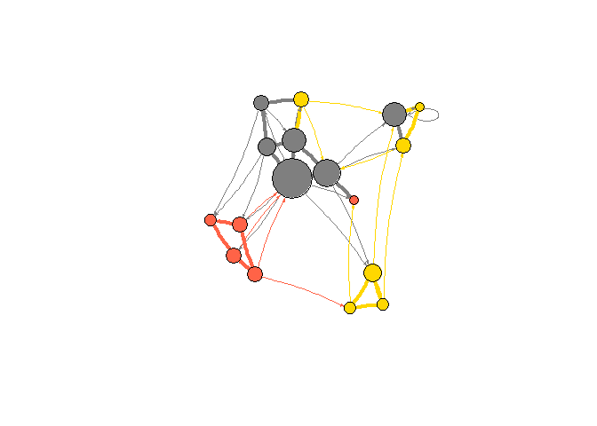

Kateto Basics Visualization
================

``` r
pacman::p_load(
        rio,            # import and export files
        here,           # locate files 
        tidyverse,      # data management and visualization
        igraph,
        visNetwork
)
```

## Data

``` r
# data #------------------------------------------
```

### Dataset1: Edge list

``` r
(nodes <- rio::import(here("network_viz_kateto/data/Dataset1-Media-Example-NODES.csv")) %>%
        tibble())
```

    ## # A tibble: 17 × 5
    ##    id    media               media.type type.label audience.size
    ##    <chr> <chr>                    <int> <chr>              <int>
    ##  1 s01   NY Times                     1 Newspaper             20
    ##  2 s02   Washington Post              1 Newspaper             25
    ##  3 s03   Wall Street Journal          1 Newspaper             30
    ##  4 s04   USA Today                    1 Newspaper             32
    ##  5 s05   LA Times                     1 Newspaper             20
    ##  6 s06   New York Post                1 Newspaper             50
    ##  7 s07   CNN                          2 TV                    56
    ##  8 s08   MSNBC                        2 TV                    34
    ##  9 s09   FOX News                     2 TV                    60
    ## 10 s10   ABC                          2 TV                    23
    ## 11 s11   BBC                          2 TV                    34
    ## 12 s12   Yahoo News                   3 Online                33
    ## 13 s13   Google News                  3 Online                23
    ## 14 s14   Reuters.com                  3 Online                12
    ## 15 s15   NYTimes.com                  3 Online                24
    ## 16 s16   WashingtonPost.com           3 Online                28
    ## 17 s17   AOL.com                      3 Online                33

``` r
(links <- rio::import(here("network_viz_kateto/data/Dataset1-Media-Example-EDGES.csv")) %>%
        tibble())
```

    ## # A tibble: 49 × 4
    ##    from  to    type      weight
    ##    <chr> <chr> <chr>      <int>
    ##  1 s01   s02   hyperlink     22
    ##  2 s01   s03   hyperlink     22
    ##  3 s01   s04   hyperlink     21
    ##  4 s01   s15   mention       20
    ##  5 s02   s01   hyperlink     23
    ##  6 s02   s03   hyperlink     21
    ##  7 s02   s09   hyperlink      1
    ##  8 s02   s10   hyperlink      5
    ##  9 s03   s01   hyperlink     21
    ## 10 s03   s04   hyperlink     22
    ## # ℹ 39 more rows

### Dataset2: Matrix

``` r
(nodes2 <- rio::import(here("network_viz_kateto/data/Dataset2-Media-User-Example-NODES.csv")) %>%
        tibble())
```

    ## # A tibble: 30 × 5
    ##    id    media   media.type media.name audience.size
    ##    <chr> <chr>        <int> <chr>              <int>
    ##  1 s01   NYT              1 Newspaper             20
    ##  2 s02   WaPo             1 Newspaper             25
    ##  3 s03   WSJ              1 Newspaper             30
    ##  4 s04   USAT             1 Newspaper             32
    ##  5 s05   LATimes          1 Newspaper             20
    ##  6 s06   CNN              2 TV                    56
    ##  7 s07   MSNBC            2 TV                    34
    ##  8 s08   FOX              2 TV                    60
    ##  9 s09   ABC              2 TV                    23
    ## 10 s10   BBC              2 TV                    34
    ## # ℹ 20 more rows

``` r
(links2 <- rio::import(here("network_viz_kateto/data/Dataset2-Media-User-Example-EDGES.csv")) %>%
        tibble())
```

    ## # A tibble: 10 × 21
    ##    V1      U01   U02   U03   U04   U05   U06   U07   U08   U09   U10   U11   U12   U13   U14   U15   U16   U17
    ##    <chr> <int> <int> <int> <int> <int> <int> <int> <int> <int> <int> <int> <int> <int> <int> <int> <int> <int>
    ##  1 s01       1     1     1     0     0     0     0     0     0     0     0     0     0     0     0     0     0
    ##  2 s02       0     0     0     1     1     0     0     0     0     0     0     0     0     0     0     0     0
    ##  3 s03       0     0     0     0     0     1     1     1     1     0     0     0     0     0     0     0     0
    ##  4 s04       0     0     0     0     0     0     0     0     1     1     1     0     0     0     0     0     0
    ##  5 s05       0     0     0     0     0     0     0     0     0     0     1     1     1     0     0     0     0
    ##  6 s06       0     0     0     0     0     0     0     0     0     0     0     0     1     1     0     0     1
    ##  7 s07       0     0     0     0     0     0     0     0     0     0     0     0     0     1     1     1     0
    ##  8 s08       0     0     0     0     0     0     0     0     0     0     0     0     0     0     0     1     1
    ##  9 s09       0     0     0     0     0     1     0     0     0     0     0     0     0     0     0     0     0
    ## 10 s10       1     0     0     0     0     0     0     0     0     0     1     0     0     0     0     0     0
    ## # ℹ 3 more variables: U18 <int>, U19 <int>, U20 <int>

## Basic graph

``` r
# basic graph #----------------------------
```

Create graph

``` r
# dataset1
(net <- igraph::graph_from_data_frame(d = links,
                                     vertices = nodes,
                                     directed = TRUE))
```

    ## IGRAPH 52b9410 DNW- 17 49 -- 
    ## + attr: name (v/c), media (v/c), media.type (v/n), type.label (v/c), audience.size (v/n), type
    ## | (e/c), weight (e/n)
    ## + edges from 52b9410 (vertex names):
    ##  [1] s01->s02 s01->s03 s01->s04 s01->s15 s02->s01 s02->s03 s02->s09 s02->s10 s03->s01 s03->s04 s03->s05 s03->s08
    ## [13] s03->s10 s03->s11 s03->s12 s04->s03 s04->s06 s04->s11 s04->s12 s04->s17 s05->s01 s05->s02 s05->s09 s05->s15
    ## [25] s06->s06 s06->s16 s06->s17 s07->s03 s07->s08 s07->s10 s07->s14 s08->s03 s08->s07 s08->s09 s09->s10 s10->s03
    ## [37] s12->s06 s12->s13 s12->s14 s13->s12 s13->s17 s14->s11 s14->s13 s15->s01 s15->s04 s15->s06 s16->s06 s16->s17
    ## [49] s17->s04

``` r
# dataset2
(links2 <- as.matrix(links2))
```

    ##       V1    U01 U02 U03 U04 U05 U06 U07 U08 U09 U10 U11 U12 U13 U14 U15 U16 U17 U18 U19 U20
    ##  [1,] "s01" "1" "1" "1" "0" "0" "0" "0" "0" "0" "0" "0" "0" "0" "0" "0" "0" "0" "0" "0" "0"
    ##  [2,] "s02" "0" "0" "0" "1" "1" "0" "0" "0" "0" "0" "0" "0" "0" "0" "0" "0" "0" "0" "0" "1"
    ##  [3,] "s03" "0" "0" "0" "0" "0" "1" "1" "1" "1" "0" "0" "0" "0" "0" "0" "0" "0" "0" "0" "0"
    ##  [4,] "s04" "0" "0" "0" "0" "0" "0" "0" "0" "1" "1" "1" "0" "0" "0" "0" "0" "0" "0" "0" "0"
    ##  [5,] "s05" "0" "0" "0" "0" "0" "0" "0" "0" "0" "0" "1" "1" "1" "0" "0" "0" "0" "0" "0" "0"
    ##  [6,] "s06" "0" "0" "0" "0" "0" "0" "0" "0" "0" "0" "0" "0" "1" "1" "0" "0" "1" "0" "0" "0"
    ##  [7,] "s07" "0" "0" "0" "0" "0" "0" "0" "0" "0" "0" "0" "0" "0" "1" "1" "1" "0" "0" "0" "0"
    ##  [8,] "s08" "0" "0" "0" "0" "0" "0" "0" "0" "0" "0" "0" "0" "0" "0" "0" "1" "1" "1" "1" "0"
    ##  [9,] "s09" "0" "0" "0" "0" "0" "1" "0" "0" "0" "0" "0" "0" "0" "0" "0" "0" "0" "0" "1" "1"
    ## [10,] "s10" "1" "0" "0" "0" "0" "0" "0" "0" "0" "0" "1" "0" "0" "0" "0" "0" "0" "0" "0" "0"

``` r
(net2 <- graph_from_biadjacency_matrix(links2))
```

    ## Warning in mde(x): NAs introduced by coercion

    ## IGRAPH 52bb17f U--B 31 41 -- 
    ## + attr: type (v/l)
    ## + edges from 52bb17f:
    ##  [1]  1--11  1--12  1--13  1--14  2--11  2--15  2--16  2--31  3--11  3--17  3--18  3--19  3--20  4--11  4--20
    ## [16]  4--21  4--22  5--11  5--22  5--23  5--24  6--11  6--24  6--25  6--28  7--11  7--25  7--26  7--27  8--11
    ## [31]  8--27  8--28  8--29  8--30  9--11  9--17  9--30  9--31 10--11 10--12 10--22

``` r
table(V(net2)$type)
```

    ## 
    ## FALSE  TRUE 
    ##    10    21

Extract information

``` r
# extract edges
E(net)
```

    ## + 49/49 edges from 52b9410 (vertex names):
    ##  [1] s01->s02 s01->s03 s01->s04 s01->s15 s02->s01 s02->s03 s02->s09 s02->s10 s03->s01 s03->s04 s03->s05 s03->s08
    ## [13] s03->s10 s03->s11 s03->s12 s04->s03 s04->s06 s04->s11 s04->s12 s04->s17 s05->s01 s05->s02 s05->s09 s05->s15
    ## [25] s06->s06 s06->s16 s06->s17 s07->s03 s07->s08 s07->s10 s07->s14 s08->s03 s08->s07 s08->s09 s09->s10 s10->s03
    ## [37] s12->s06 s12->s13 s12->s14 s13->s12 s13->s17 s14->s11 s14->s13 s15->s01 s15->s04 s15->s06 s16->s06 s16->s17
    ## [49] s17->s04

``` r
# extract nodes
V(net)
```

    ## + 17/17 vertices, named, from 52b9410:
    ##  [1] s01 s02 s03 s04 s05 s06 s07 s08 s09 s10 s11 s12 s13 s14 s15 s16 s17

``` r
# extract attribute `type` of edges
E(net)$type
```

    ##  [1] "hyperlink" "hyperlink" "hyperlink" "mention"   "hyperlink" "hyperlink" "hyperlink" "hyperlink" "hyperlink"
    ## [10] "hyperlink" "hyperlink" "hyperlink" "mention"   "hyperlink" "hyperlink" "hyperlink" "mention"   "mention"  
    ## [19] "hyperlink" "mention"   "mention"   "hyperlink" "hyperlink" "mention"   "hyperlink" "hyperlink" "mention"  
    ## [28] "mention"   "mention"   "hyperlink" "mention"   "hyperlink" "mention"   "mention"   "mention"   "hyperlink"
    ## [37] "mention"   "hyperlink" "mention"   "hyperlink" "mention"   "mention"   "mention"   "hyperlink" "hyperlink"
    ## [46] "hyperlink" "hyperlink" "mention"   "hyperlink"

``` r
# extract attribute `media` of nodes
V(net)$media
```

    ##  [1] "NY Times"            "Washington Post"     "Wall Street Journal" "USA Today"          
    ##  [5] "LA Times"            "New York Post"       "CNN"                 "MSNBC"              
    ##  [9] "FOX News"            "ABC"                 "BBC"                 "Yahoo News"         
    ## [13] "Google News"         "Reuters.com"         "NYTimes.com"         "WashingtonPost.com" 
    ## [17] "AOL.com"

Find nodes and edges by attribute

``` r
V(net)[media == "BBC"]
```

    ## + 1/17 vertex, named, from 52b9410:
    ## [1] s11

``` r
E(net)[type == "mention"]
```

    ## + 20/49 edges from 52b9410 (vertex names):
    ##  [1] s01->s15 s03->s10 s04->s06 s04->s11 s04->s17 s05->s01 s05->s15 s06->s17 s07->s03 s07->s08 s07->s14 s08->s07
    ## [13] s08->s09 s09->s10 s12->s06 s12->s14 s13->s17 s14->s11 s14->s13 s16->s17

``` r
net[1,]
```

    ## s01 s02 s03 s04 s05 s06 s07 s08 s09 s10 s11 s12 s13 s14 s15 s16 s17 
    ##   0  22  22  21   0   0   0   0   0   0   0   0   0   0  20   0   0

``` r
net[1, 15]
```

    ## [1] 20

Get an edge list or a matrix:

``` r
as_edgelist(net, names = T)
```

    ##       [,1]  [,2] 
    ##  [1,] "s01" "s02"
    ##  [2,] "s01" "s03"
    ##  [3,] "s01" "s04"
    ##  [4,] "s01" "s15"
    ##  [5,] "s02" "s01"
    ##  [6,] "s02" "s03"
    ##  [7,] "s02" "s09"
    ##  [8,] "s02" "s10"
    ##  [9,] "s03" "s01"
    ## [10,] "s03" "s04"
    ## [11,] "s03" "s05"
    ## [12,] "s03" "s08"
    ## [13,] "s03" "s10"
    ## [14,] "s03" "s11"
    ## [15,] "s03" "s12"
    ## [16,] "s04" "s03"
    ## [17,] "s04" "s06"
    ## [18,] "s04" "s11"
    ## [19,] "s04" "s12"
    ## [20,] "s04" "s17"
    ## [21,] "s05" "s01"
    ## [22,] "s05" "s02"
    ## [23,] "s05" "s09"
    ## [24,] "s05" "s15"
    ## [25,] "s06" "s06"
    ## [26,] "s06" "s16"
    ## [27,] "s06" "s17"
    ## [28,] "s07" "s03"
    ## [29,] "s07" "s08"
    ## [30,] "s07" "s10"
    ## [31,] "s07" "s14"
    ## [32,] "s08" "s03"
    ## [33,] "s08" "s07"
    ## [34,] "s08" "s09"
    ## [35,] "s09" "s10"
    ## [36,] "s10" "s03"
    ## [37,] "s12" "s06"
    ## [38,] "s12" "s13"
    ## [39,] "s12" "s14"
    ## [40,] "s13" "s12"
    ## [41,] "s13" "s17"
    ## [42,] "s14" "s11"
    ## [43,] "s14" "s13"
    ## [44,] "s15" "s01"
    ## [45,] "s15" "s04"
    ## [46,] "s15" "s06"
    ## [47,] "s16" "s06"
    ## [48,] "s16" "s17"
    ## [49,] "s17" "s04"

``` r
as_adjacency_matrix(net, attr = "weight")
```

    ## 17 x 17 sparse Matrix of class "dgCMatrix"

    ##   [[ suppressing 17 column names 's01', 's02', 's03' ... ]]

    ##                                                      
    ## s01  . 22 22 21 .  .  .  .  .  .  .  .  .  . 20  .  .
    ## s02 23  . 21  . .  .  .  .  1  5  .  .  .  .  .  .  .
    ## s03 21  .  . 22 1  .  .  4  .  2  1  1  .  .  .  .  .
    ## s04  .  . 23  . .  1  .  .  .  . 22  3  .  .  .  .  2
    ## s05  1 21  .  . .  .  .  .  2  .  .  .  .  . 21  .  .
    ## s06  .  .  .  . .  1  .  .  .  .  .  .  .  .  . 21 21
    ## s07  .  .  1  . .  .  . 22  . 21  .  .  .  4  .  .  .
    ## s08  .  .  2  . .  . 21  . 23  .  .  .  .  .  .  .  .
    ## s09  .  .  .  . .  .  .  .  . 21  .  .  .  .  .  .  .
    ## s10  .  .  2  . .  .  .  .  .  .  .  .  .  .  .  .  .
    ## s11  .  .  .  . .  .  .  .  .  .  .  .  .  .  .  .  .
    ## s12  .  .  .  . .  2  .  .  .  .  .  . 22 22  .  .  .
    ## s13  .  .  .  . .  .  .  .  .  .  . 21  .  .  .  .  1
    ## s14  .  .  .  . .  .  .  .  .  .  1  . 21  .  .  .  .
    ## s15 22  .  .  1 .  4  .  .  .  .  .  .  .  .  .  .  .
    ## s16  .  .  .  . . 23  .  .  .  .  .  .  .  .  .  . 21
    ## s17  .  .  .  4 .  .  .  .  .  .  .  .  .  .  .  .  .

Get data frames describing nodes and edges:

``` r
as_data_frame(net, what = "edges")
```

    ##    from  to      type weight
    ## 1   s01 s02 hyperlink     22
    ## 2   s01 s03 hyperlink     22
    ## 3   s01 s04 hyperlink     21
    ## 4   s01 s15   mention     20
    ## 5   s02 s01 hyperlink     23
    ## 6   s02 s03 hyperlink     21
    ## 7   s02 s09 hyperlink      1
    ## 8   s02 s10 hyperlink      5
    ## 9   s03 s01 hyperlink     21
    ## 10  s03 s04 hyperlink     22
    ## 11  s03 s05 hyperlink      1
    ## 12  s03 s08 hyperlink      4
    ## 13  s03 s10   mention      2
    ## 14  s03 s11 hyperlink      1
    ## 15  s03 s12 hyperlink      1
    ## 16  s04 s03 hyperlink     23
    ## 17  s04 s06   mention      1
    ## 18  s04 s11   mention     22
    ## 19  s04 s12 hyperlink      3
    ## 20  s04 s17   mention      2
    ## 21  s05 s01   mention      1
    ## 22  s05 s02 hyperlink     21
    ## 23  s05 s09 hyperlink      2
    ## 24  s05 s15   mention     21
    ## 25  s06 s06 hyperlink      1
    ## 26  s06 s16 hyperlink     21
    ## 27  s06 s17   mention     21
    ## 28  s07 s03   mention      1
    ## 29  s07 s08   mention     22
    ## 30  s07 s10 hyperlink     21
    ## 31  s07 s14   mention      4
    ## 32  s08 s03 hyperlink      2
    ## 33  s08 s07   mention     21
    ## 34  s08 s09   mention     23
    ## 35  s09 s10   mention     21
    ## 36  s10 s03 hyperlink      2
    ## 37  s12 s06   mention      2
    ## 38  s12 s13 hyperlink     22
    ## 39  s12 s14   mention     22
    ## 40  s13 s12 hyperlink     21
    ## 41  s13 s17   mention      1
    ## 42  s14 s11   mention      1
    ## 43  s14 s13   mention     21
    ## 44  s15 s01 hyperlink     22
    ## 45  s15 s04 hyperlink      1
    ## 46  s15 s06 hyperlink      4
    ## 47  s16 s06 hyperlink     23
    ## 48  s16 s17   mention     21
    ## 49  s17 s04 hyperlink      4

``` r
as_data_frame(net, what = "vertices")
```

    ##     name               media media.type type.label audience.size
    ## s01  s01            NY Times          1  Newspaper            20
    ## s02  s02     Washington Post          1  Newspaper            25
    ## s03  s03 Wall Street Journal          1  Newspaper            30
    ## s04  s04           USA Today          1  Newspaper            32
    ## s05  s05            LA Times          1  Newspaper            20
    ## s06  s06       New York Post          1  Newspaper            50
    ## s07  s07                 CNN          2         TV            56
    ## s08  s08               MSNBC          2         TV            34
    ## s09  s09            FOX News          2         TV            60
    ## s10  s10                 ABC          2         TV            23
    ## s11  s11                 BBC          2         TV            34
    ## s12  s12          Yahoo News          3     Online            33
    ## s13  s13         Google News          3     Online            23
    ## s14  s14         Reuters.com          3     Online            12
    ## s15  s15         NYTimes.com          3     Online            24
    ## s16  s16  WashingtonPost.com          3     Online            28
    ## s17  s17             AOL.com          3     Online            33

Basic plot

``` r
plot(net)
```

<!-- -->

``` r
plot(net, edge.arrow.size = .4, vertex.label = NA)
```

<!-- -->

## Basic plot

### Basic

``` r
# basic plot #--------------------
plot(net, edge.arrow.size = .4, edge.curved = .5)
```

<!-- -->

``` r
plot(net,
  edge.arrow.size = .2, edge.color = "orange",
  vertex.color = "orange", vertex.frame.color = "#ffffff",
  vertex.label = V(net)$media, vertex.label.color = "black")
```

<!-- -->

### Change color & node size

``` r
# generate colors based on media type
(colrs <- c("gray50", "tomato", "gold"))
```

    ## [1] "gray50" "tomato" "gold"

``` r
(V(net)$color <- colrs[V(net)$media.type])
```

    ##  [1] "gray50" "gray50" "gray50" "gray50" "gray50" "gray50" "tomato" "tomato" "tomato" "tomato" "tomato" "gold"  
    ## [13] "gold"   "gold"   "gold"   "gold"   "gold"

``` r
# node degree (to set node size)
(deg <- degree(net, mode = "all"))
```

    ## s01 s02 s03 s04 s05 s06 s07 s08 s09 s10 s11 s12 s13 s14 s15 s16 s17 
    ##   8   6  13   9   5   8   5   5   4   5   3   6   4   4   5   3   5

``` r
(V(net)$size <- deg*3)
```

    ## s01 s02 s03 s04 s05 s06 s07 s08 s09 s10 s11 s12 s13 s14 s15 s16 s17 
    ##  24  18  39  27  15  24  15  15  12  15   9  18  12  12  15   9  15

``` r
# set edge width based on weight
(E(net)$width <- E(net)$weight/5)
```

    ##  [1] 4.4 4.4 4.2 4.0 4.6 4.2 0.2 1.0 4.2 4.4 0.2 0.8 0.4 0.2 0.2 4.6 0.2 4.4 0.6 0.4 0.2 4.2 0.4 4.2 0.2 4.2 4.2
    ## [28] 0.2 4.4 4.2 0.8 0.4 4.2 4.6 4.2 0.4 0.4 4.4 4.4 4.2 0.2 0.2 4.2 4.4 0.2 0.8 4.6 4.2 0.8

``` r
plot(net,
     edge.arrow.size = .2,
     edge.color = "gray80",
     vertex.label = NA,
     layout = layout_with_fr)
```

<!-- -->

### Add legend

``` r
# legend(x = "bottomleft",
#        c("Newspaper", "Television", "Online News"),
#        pch = 21,
#        col = "#777777", pt.bg = colrs,
#        pt.cex = 2, cex = 0.8,
#        bty = "n",
#        ncol = 1)
```

### Edges color based on nodes color

``` r
(edge.start <- ends(net, es = E(net), names = F)[,1])
```

    ##  [1]  1  1  1  1  2  2  2  2  3  3  3  3  3  3  3  4  4  4  4  4  5  5  5  5  6  6  6  7  7  7  7  8  8  8  9 10
    ## [37] 12 12 12 13 13 14 14 15 15 15 16 16 17

``` r
(edge.col <- V(net)$color[edge.start])
```

    ##  [1] "gray50" "gray50" "gray50" "gray50" "gray50" "gray50" "gray50" "gray50" "gray50" "gray50" "gray50" "gray50"
    ## [13] "gray50" "gray50" "gray50" "gray50" "gray50" "gray50" "gray50" "gray50" "gray50" "gray50" "gray50" "gray50"
    ## [25] "gray50" "gray50" "gray50" "tomato" "tomato" "tomato" "tomato" "tomato" "tomato" "tomato" "tomato" "tomato"
    ## [37] "gold"   "gold"   "gold"   "gold"   "gold"   "gold"   "gold"   "gold"   "gold"   "gold"   "gold"   "gold"  
    ## [49] "gold"

``` r
plot(net,
     edge.arrow.size = .2,
     edge.color = edge.col,
     edge.curved = 0.1,
     vertex.label = NA,
     layout = layout_with_fr)
```

<!-- -->

## Network layout

``` r
# layout #-----------------------

(net.bg <- sample_pa(100))
```

    ## IGRAPH 535a5e7 D--- 100 99 -- Barabasi graph
    ## + attr: name (g/c), power (g/n), m (g/n), zero.appeal (g/n), algorithm (g/c)
    ## + edges from 535a5e7:
    ##  [1]   2-> 1   3-> 1   4-> 1   5-> 3   6-> 5   7-> 1   8-> 4   9-> 8  10-> 1  11-> 5  12-> 1  13-> 1  14-> 1
    ## [14]  15->13  16-> 9  17->10  18-> 1  19-> 6  20->14  21-> 1  22-> 5  23->12  24-> 1  25-> 5  26-> 1  27->20
    ## [27]  28->10  29-> 2  30->20  31-> 5  32->12  33->12  34->14  35-> 5  36-> 6  37->27  38->22  39->11  40->20
    ## [40]  41->25  42->25  43->20  44->17  45->20  46-> 1  47->17  48->22  49->26  50-> 4  51-> 1  52->13  53->22
    ## [53]  54-> 5  55->25  56->27  57->27  58-> 1  59->29  60->10  61-> 6  62->29  63-> 1  64->17  65->29  66->37
    ## [66]  67->12  68->50  69->33  70->20  71->17  72->59  73->11  74-> 5  75-> 1  76->67  77-> 1  78->42  79->67
    ## [79]  80->17  81->20  82-> 1  83-> 1  84->17  85->13  86->72  87->10  88->75  89-> 1  90->13  91->42  92-> 5
    ## [92]  93->13  94->40  95-> 1  96-> 5  97->45  98-> 1  99->10 100-> 1

``` r
V(net.bg)$size <- 8
V(net.bg)$frame.color <- "white"
V(net.bg)$color <- "orange"
V(net.bg)$label <- ""
E(net.bg)$arrow.mode <- 0
```

Set layout

``` r
plot(net.bg)
```

<!-- -->

``` r
plot(net.bg, layout = layout_randomly)
```

<!-- -->

``` r
plot(net.bg, layout = layout_in_circle)
```

<!-- -->

``` r
plot(net.bg, layout = layout_on_sphere)
```

<!-- -->

``` r
## Fruchterman Reingold #----------------------------------
plot(net.bg, layout = layout_with_fr)
```

<!-- -->

``` r
plot(net.bg, layout = layout_with_fr(net.bg, niter = 50))
```

<!-- -->

``` r
# save layout in `lw` to get same network in different runs
ws <- c(1, rep(100, ecount(net.bg)-1))
lw <- layout_with_fr(net.bg, weights = ws)
plot(net.bg, layout = lw)
```

<!-- -->

Rescale layouts

``` r
# l <- layout_with_fr(net.bg)
# l <- norm_coords(l, ymin = -1, ymax = 1, xmin = -1, xmax = 1)
# par(mfrow = c(2, 2), mar = c(0, 0, 0, 0))
# plot(net.bg, rescale = F, layout = l * 0.4)
# plot(net.bg, rescale = F, layout = l * 0.6)
# plot(net.bg, rescale = F, layout = l * 0.8)
# plot(net.bg, rescale = F, layout = l * 1.0)
# 
# dev.off()
```

``` r
# 3D version
l <- layout_with_fr(net.bg, dim = 3)
plot(net.bg, layout = l)
```

<!-- -->

``` r
## Kamada Kawai #---------------------------------
l <- layout_with_kk(net.bg)
plot(net.bg, layout = l)
```

<!-- -->

``` r
## Graphopt #----------------------------------
l <- layout_with_graphopt(net.bg)
plot(net.bg, layout = l)
```

<!-- -->

``` r
# change mass and electric charge of nodes
l1 <- layout_with_graphopt(net.bg, charge = 0.02)
l2 <- layout_with_graphopt(net.bg, charge = 0.00000001)

plot(net.bg, layout = l1)
```

<!-- -->

``` r
plot(net.bg, layout = l2)
```

<!-- -->

``` r
## LGL #----------------------------------
# large, connected graphs
plot(net.bg, layout = layout_with_lgl)
```

<!-- -->

``` r
## MDS #------------------------
# multidimensional scaling
plot(net.bg, layout = layout_with_mds)
```

<!-- -->

## Highlight aspects of network

``` r
# highlight parts #-------------------------
```

### Community detection by optimizing modularity over partitions

``` r
## cluster #----------------
clp <- cluster_optimal(net)
class(clp)
```

    ## [1] "communities"

``` r
plot(clp, net, layout = layout_with_fr)
```

<!-- -->

Customized colors

``` r
V(net)$community <- clp$membership
colrs <- adjustcolor( c("gray50", "tomato", "gold", "yellowgreen"),
                      alpha=.6)
plot(net,
     vertex.color = colrs[V(net)$community],
     layout = layout_with_fr)
```

<!-- -->

### Highlight specific part

``` r
## manually #-------------------------------
plot(net,
     mark.groups = c(1, 4, 5, 8),
     mark.col = "#C5E5E7",
     mark.border = NA,
     layout = layout_with_fr)
```

<!-- -->

``` r
plot(net,
  mark.groups = list(c(1, 4, 5, 8), c(15:17)),
  mark.col = c("#C5E5E7", "#ECD89A"),
  mark.border = NA,
  layout = layout_with_fr)
```

<!-- -->

### Highlight a path

``` r
inc.edges <- incident(net, V(net)[media == "Wall Street Journal"], mode = "all")

# Set colors to plot the selected edges.
ecol <- rep("gray80", ecount(net))
ecol[inc.edges] <- "orange"
vcol <- rep("grey40", vcount(net))
vcol[V(net)$media == "Wall Street Journal"] <- "gold"

plot(net,
     vertex.color = vcol,
     edge.color = ecol,
     vertex.label = NA)
```

<!-- -->

### Highlight neighbor nodes

``` r
neigh.nodes <- neighbors(net,
                         V(net)[media == "Wall Street Journal"],
                         mode = "out")
vcol[neigh.nodes] <- "#ff9d00"

plot(net,
     vertex.color = vcol,
     vertex.label = NA)
```

<!-- -->

## 2-mode network

``` r
# 2-mode network #------------------------
plot(net2, vertex.label = NA)
```

<!-- -->

Customized color & shape

``` r
# media outlets = blue squares, audience nodes = orange circles
V(net2)$color <- c("steel blue", "orange")[V(net2)$type+1]
V(net2)$shape <- c("square", "circle")[V(net2)$type+1]

# media outlets -> named labels, audience members -> NA
V(net2)$label <- ""
V(net2)$label[V(net2)$type == F] <- nodes2$media[V(net2)$type == F]
V(net2)$label.cex <- .6
V(net2)$label.font <- 2

plot(net2, vertex.label.color = "white", vertex.size = (2 - V(net2)$type) * 8)
```

<!-- -->

Layout

``` r
plot(net2, vertex.label = NA, vertex.size = 7, layout = layout.bipartite)
```

<!-- -->

Text as node

``` r
plot(net2,
     vertex.shape = "none", 
     vertex.label = nodes2$media,
     vertex.label.color = V(net2)$color, 
     vertex.label.font = 2,
     vertex.label.cex = .6, 
     edge.color = "gray70", 
     edge.width = 2)
```

<!-- -->

Separate mode

``` r
net2.bp <- bipartite.projection(net2)
```

    ## Warning: `bipartite.projection()` was deprecated in igraph 2.0.0.
    ## ℹ Please use `bipartite_projection()` instead.
    ## This warning is displayed once every 8 hours.
    ## Call `lifecycle::last_lifecycle_warnings()` to see where this warning was generated.

``` r
plot(net2.bp$proj1,
  vertex.label.color = "black", vertex.label.dist = 1,
  vertex.label = nodes2$media[!is.na(nodes2$media.type)])
```

<!-- -->

``` r
plot(net2.bp$proj2,
  vertex.label.color = "black", vertex.label.dist = 1,
  vertex.label = nodes2$media[is.na(nodes2$media.type)]) 
```

<!-- -->

## Multiplex networks

``` r
# multiplex networks #------------------
E(net)$width <- 1.5

plot(net,
  edge.color = c("dark red", "slategrey")[(E(net)$type == "hyperlink") + 1],
  vertex.color = "gray40",
  layout = layout_in_circle,
  edge.curved = .3,
  vertex.label = NA)
```

<!-- -->

``` r
# delete edges using minus operator
net.m <- net - E(net)[E(net)$type == "hyperlink"]
net.h <- net - E(net)[E(net)$type == "mention"]

# plot two links separately

l <- layout_with_fr(net)
plot(net.h,
     edge.arrow.size = 0.2,
     vertex.color = "orange",
     layout = l,
     main = "Tie: Hyperlink")
```

<!-- -->

``` r
plot(net.m,
     edge.arrow.size = 0.2,
     vertex.color = "lightsteelblue2",
     layout = l,
     main = "Tie: Mention")
```

<!-- -->

## Interactive plot

``` r
# interactive #----------------------------
```

### tkplot

``` r
## tkplot #---------------------

# tkid: id of the tkplot that will open
# tkid <- tkplot(net) 

# grab the coordinates from tkplot
# l <- tkplot.getcoords(tkid) 

# plot(net, layout=l)
```

### visNetwork

``` r
## visNetwork #---------------------------
visNetwork::visNetwork(nodes, 
                       links,
                       width = "100%",
                       height = "400px")
```

<!-- -->

``` r
# customize color & size
(vis.nodes <- nodes %>%
                mutate(shape = "dot",
                       shadow = TRUE,
                       title = media,
                       label = type.label,
                       size = audience.size,
                       borderWidth = 2,
                       color.background = case_when(media.type == 1 ~ "slategrey",
                                                    media.type == 2 ~ "tomato",
                                                    media.type == 3 ~ "gold"),
                       color.border = "black",
                       color.highlight.background = "orange",
                       color.highlight.border = "darkred"))
```

    ## # A tibble: 17 × 15
    ##    id    media    media.type type.label audience.size shape shadow title label  size borderWidth color.background
    ##    <chr> <chr>         <int> <chr>              <int> <chr> <lgl>  <chr> <chr> <int>       <dbl> <chr>           
    ##  1 s01   NY Times          1 Newspaper             20 dot   TRUE   NY T… News…    20           2 slategrey       
    ##  2 s02   Washing…          1 Newspaper             25 dot   TRUE   Wash… News…    25           2 slategrey       
    ##  3 s03   Wall St…          1 Newspaper             30 dot   TRUE   Wall… News…    30           2 slategrey       
    ##  4 s04   USA Tod…          1 Newspaper             32 dot   TRUE   USA … News…    32           2 slategrey       
    ##  5 s05   LA Times          1 Newspaper             20 dot   TRUE   LA T… News…    20           2 slategrey       
    ##  6 s06   New Yor…          1 Newspaper             50 dot   TRUE   New … News…    50           2 slategrey       
    ##  7 s07   CNN               2 TV                    56 dot   TRUE   CNN   TV       56           2 tomato          
    ##  8 s08   MSNBC             2 TV                    34 dot   TRUE   MSNBC TV       34           2 tomato          
    ##  9 s09   FOX News          2 TV                    60 dot   TRUE   FOX … TV       60           2 tomato          
    ## 10 s10   ABC               2 TV                    23 dot   TRUE   ABC   TV       23           2 tomato          
    ## 11 s11   BBC               2 TV                    34 dot   TRUE   BBC   TV       34           2 tomato          
    ## 12 s12   Yahoo N…          3 Online                33 dot   TRUE   Yaho… Onli…    33           2 gold            
    ## 13 s13   Google …          3 Online                23 dot   TRUE   Goog… Onli…    23           2 gold            
    ## 14 s14   Reuters…          3 Online                12 dot   TRUE   Reut… Onli…    12           2 gold            
    ## 15 s15   NYTimes…          3 Online                24 dot   TRUE   NYTi… Onli…    24           2 gold            
    ## 16 s16   Washing…          3 Online                28 dot   TRUE   Wash… Onli…    28           2 gold            
    ## 17 s17   AOL.com           3 Online                33 dot   TRUE   AOL.… Onli…    33           2 gold            
    ## # ℹ 3 more variables: color.border <chr>, color.highlight.background <chr>, color.highlight.border <chr>

``` r
(vis.links <- links)
```

    ## # A tibble: 49 × 4
    ##    from  to    type      weight
    ##    <chr> <chr> <chr>      <int>
    ##  1 s01   s02   hyperlink     22
    ##  2 s01   s03   hyperlink     22
    ##  3 s01   s04   hyperlink     21
    ##  4 s01   s15   mention       20
    ##  5 s02   s01   hyperlink     23
    ##  6 s02   s03   hyperlink     21
    ##  7 s02   s09   hyperlink      1
    ##  8 s02   s10   hyperlink      5
    ##  9 s03   s01   hyperlink     21
    ## 10 s03   s04   hyperlink     22
    ## # ℹ 39 more rows

``` r
visNetwork(vis.nodes, vis.links)
```

<!-- -->

``` r
# customize arrow edges
(vis.links <- vis.links %>%
        mutate(width = 1 + links$weight/8, # line width
               color = "gray", # line color
               arrows = "middle", # arrow: `from`, `to`, `middle`
               smooth = FALSE, # edges: curved?
               shadow = FALSE))
```

    ## # A tibble: 49 × 9
    ##    from  to    type      weight width color arrows smooth shadow
    ##    <chr> <chr> <chr>      <int> <dbl> <chr> <chr>  <lgl>  <lgl> 
    ##  1 s01   s02   hyperlink     22  3.75 gray  middle FALSE  FALSE 
    ##  2 s01   s03   hyperlink     22  3.75 gray  middle FALSE  FALSE 
    ##  3 s01   s04   hyperlink     21  3.62 gray  middle FALSE  FALSE 
    ##  4 s01   s15   mention       20  3.5  gray  middle FALSE  FALSE 
    ##  5 s02   s01   hyperlink     23  3.88 gray  middle FALSE  FALSE 
    ##  6 s02   s03   hyperlink     21  3.62 gray  middle FALSE  FALSE 
    ##  7 s02   s09   hyperlink      1  1.12 gray  middle FALSE  FALSE 
    ##  8 s02   s10   hyperlink      5  1.62 gray  middle FALSE  FALSE 
    ##  9 s03   s01   hyperlink     21  3.62 gray  middle FALSE  FALSE 
    ## 10 s03   s04   hyperlink     22  3.75 gray  middle FALSE  FALSE 
    ## # ℹ 39 more rows

``` r
visnet <- visNetwork(vis.nodes, vis.links)
visnet
```

<!-- -->

``` r
# interactive options
visOptions(visnet,
           highlightNearest = TRUE,
           selectedBy = "label")
```

<!-- -->

``` r
# rmarkdown::render()
```
