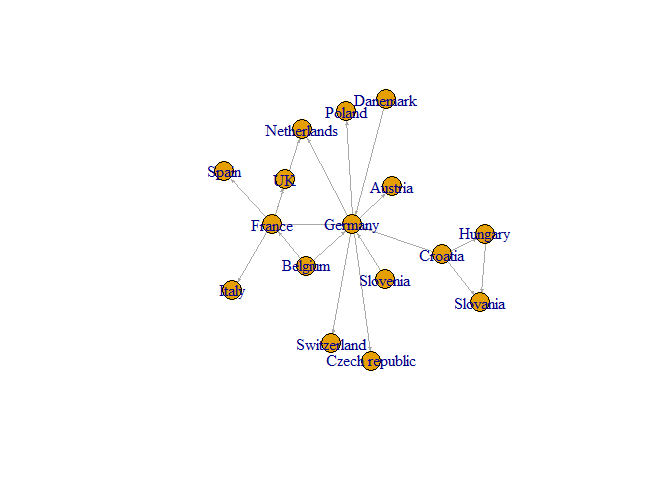
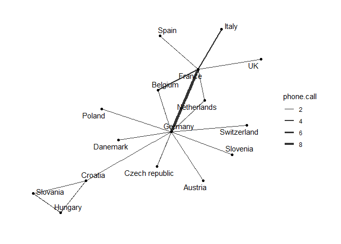
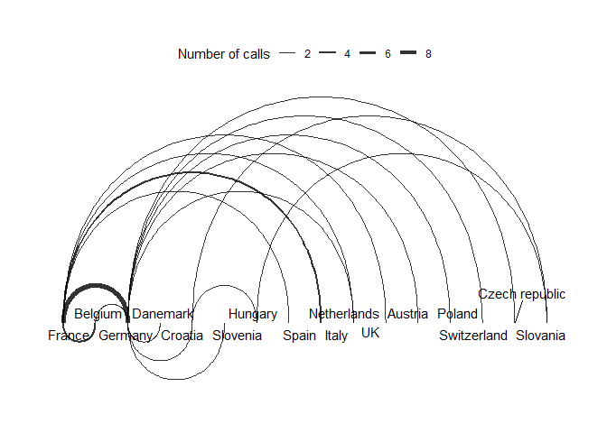
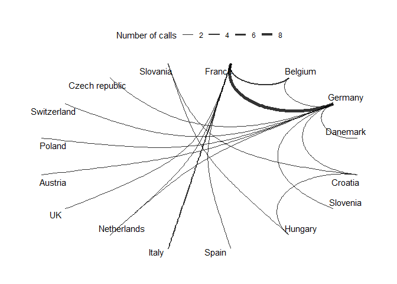
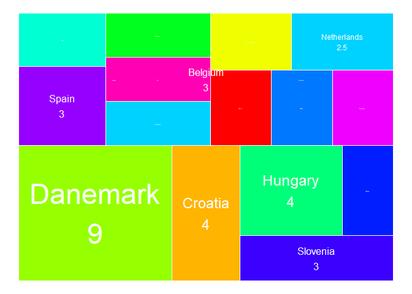

Network Visualization Essentials in R - STHDA
================
trucl
2024-06-14

``` r
pacman::p_load(
        rio,            # import and export files
        here,           # locate files 
        tidyverse,      # data management and visualization
        igraph,         # network visualization
        tidygraph,      # network data manipulation
        ggraph          # network visualization
)
```

## Demo dataset

``` r
# data #-----------------------
(phone_call <- import(here("network_viz_sthda/phone.call.rda")))
```

    ##      source    destination n.call
    ## 1    France        Germany    9.0
    ## 2   Belgium         France    4.0
    ## 3    France          Spain    3.0
    ## 4    France          Italy    4.0
    ## 5    France    Netherlands    2.0
    ## 6    France             UK    3.0
    ## 7   Germany        Austria    2.0
    ## 8   Germany         Poland    2.0
    ## 9   Belgium        Germany    3.0
    ## 10  Germany    Switzerland    2.0
    ## 11  Germany Czech republic    2.0
    ## 12  Germany    Netherlands    2.0
    ## 13 Danemark        Germany    2.0
    ## 14  Croatia        Germany    2.0
    ## 15  Croatia       Slovania    2.0
    ## 16  Croatia        Hungary    2.0
    ## 17 Slovenia        Germany    2.0
    ## 18  Hungary       Slovania    2.5

- nodes: countries in `source`, `destination`
- edges weight: values in `n.call`

### Node list

``` r
## node list #----------------------

# take the distinct countries from “source” and “destination” columns
(sources <- phone_call %>%
        distinct(source) %>%
        rename(label = source))
```

    ##      label
    ## 1   France
    ## 2  Belgium
    ## 3  Germany
    ## 4 Danemark
    ## 5  Croatia
    ## 6 Slovenia
    ## 7  Hungary

``` r
(destinations <- phone_call %>%
        distinct(destination) %>%
        rename(label = destination))
```

    ##             label
    ## 1         Germany
    ## 2          France
    ## 3           Spain
    ## 4           Italy
    ## 5     Netherlands
    ## 6              UK
    ## 7         Austria
    ## 8          Poland
    ## 9     Switzerland
    ## 10 Czech republic
    ## 11       Slovania
    ## 12        Hungary

``` r
# join two data to create node
(nodes <- sources %>%
        full_join(destinations, by = "label") %>%
        # create unique node ID
        rowid_to_column(var = "id"))
```

    ##    id          label
    ## 1   1         France
    ## 2   2        Belgium
    ## 3   3        Germany
    ## 4   4       Danemark
    ## 5   5        Croatia
    ## 6   6       Slovenia
    ## 7   7        Hungary
    ## 8   8          Spain
    ## 9   9          Italy
    ## 10 10    Netherlands
    ## 11 11             UK
    ## 12 12        Austria
    ## 13 13         Poland
    ## 14 14    Switzerland
    ## 15 15 Czech republic
    ## 16 16       Slovania

### Edge list

``` r
## edge list #----------------------
# join nodes id for `source` column
(edges <- phone_call %>%
        left_join(nodes,
                  by = c("source" = "label")) %>%
        rename(from = id))
```

    ##      source    destination n.call from
    ## 1    France        Germany    9.0    1
    ## 2   Belgium         France    4.0    2
    ## 3    France          Spain    3.0    1
    ## 4    France          Italy    4.0    1
    ## 5    France    Netherlands    2.0    1
    ## 6    France             UK    3.0    1
    ## 7   Germany        Austria    2.0    3
    ## 8   Germany         Poland    2.0    3
    ## 9   Belgium        Germany    3.0    2
    ## 10  Germany    Switzerland    2.0    3
    ## 11  Germany Czech republic    2.0    3
    ## 12  Germany    Netherlands    2.0    3
    ## 13 Danemark        Germany    2.0    4
    ## 14  Croatia        Germany    2.0    5
    ## 15  Croatia       Slovania    2.0    5
    ## 16  Croatia        Hungary    2.0    5
    ## 17 Slovenia        Germany    2.0    6
    ## 18  Hungary       Slovania    2.5    7

``` r
# join nodes id for `destination` column
(edges <- edges %>%
        left_join(nodes,
                  by = c("destination" = "label")) %>%
        rename(to = id))
```

    ##      source    destination n.call from to
    ## 1    France        Germany    9.0    1  3
    ## 2   Belgium         France    4.0    2  1
    ## 3    France          Spain    3.0    1  8
    ## 4    France          Italy    4.0    1  9
    ## 5    France    Netherlands    2.0    1 10
    ## 6    France             UK    3.0    1 11
    ## 7   Germany        Austria    2.0    3 12
    ## 8   Germany         Poland    2.0    3 13
    ## 9   Belgium        Germany    3.0    2  3
    ## 10  Germany    Switzerland    2.0    3 14
    ## 11  Germany Czech republic    2.0    3 15
    ## 12  Germany    Netherlands    2.0    3 10
    ## 13 Danemark        Germany    2.0    4  3
    ## 14  Croatia        Germany    2.0    5  3
    ## 15  Croatia       Slovania    2.0    5 16
    ## 16  Croatia        Hungary    2.0    5  7
    ## 17 Slovenia        Germany    2.0    6  3
    ## 18  Hungary       Slovania    2.5    7 16

``` r
# keep only the columns `from` and `to`
(edges <- edges %>%
        select(from, to,
               weight = n.call) %>%
        mutate(weight = as.numeric(weight)))
```

    ##    from to weight
    ## 1     1  3    9.0
    ## 2     2  1    4.0
    ## 3     1  8    3.0
    ## 4     1  9    4.0
    ## 5     1 10    2.0
    ## 6     1 11    3.0
    ## 7     3 12    2.0
    ## 8     3 13    2.0
    ## 9     2  3    3.0
    ## 10    3 14    2.0
    ## 11    3 15    2.0
    ## 12    3 10    2.0
    ## 13    4  3    2.0
    ## 14    5  3    2.0
    ## 15    5 16    2.0
    ## 16    5  7    2.0
    ## 17    6  3    2.0
    ## 18    7 16    2.5

## Visualize

``` r
# plot #--------------------
```

### `igraph`

``` r
## igraph #------------------

# create igraph network object
(net.igraph <- graph_from_data_frame(d = edges,
                                    vertices = nodes, 
                                    directed = TRUE))
```

    ## IGRAPH cbfa166 DNW- 16 18 -- 
    ## + attr: name (v/c), label (v/c), weight (e/n)
    ## + edges from cbfa166 (vertex names):
    ##  [1] 1->3  2->1  1->8  1->9  1->10 1->11 3->12 3->13 2->3  3->14 3->15 3->10 4->3  5->3  5->16
    ## [16] 5->7  6->3  7->16

``` r
# create network graph
set.seed(123)

plot(net.igraph,
     edge.arrow.size = 0.2,
     layout = layout_with_graphopt)
```

<!-- -->

### `tidygraph` + `ggraph`

``` r
## ggraph #------------------

# create network object
(net.tidy <- tbl_graph(nodes = nodes,
                      edges = edges,
                      directed = TRUE))
```

    ## # A tbl_graph: 16 nodes and 18 edges
    ## #
    ## # A directed acyclic simple graph with 1 component
    ## #
    ## # Node Data: 16 × 2 (active)
    ##       id label         
    ##    <int> <chr>         
    ##  1     1 France        
    ##  2     2 Belgium       
    ##  3     3 Germany       
    ##  4     4 Danemark      
    ##  5     5 Croatia       
    ##  6     6 Slovenia      
    ##  7     7 Hungary       
    ##  8     8 Spain         
    ##  9     9 Italy         
    ## 10    10 Netherlands   
    ## 11    11 UK            
    ## 12    12 Austria       
    ## 13    13 Poland        
    ## 14    14 Switzerland   
    ## 15    15 Czech republic
    ## 16    16 Slovania      
    ## #
    ## # Edge Data: 18 × 3
    ##    from    to weight
    ##   <int> <int>  <dbl>
    ## 1     1     3      9
    ## 2     2     1      4
    ## 3     1     8      3
    ## # ℹ 15 more rows

``` r
# plot
ggraph(net.tidy, layout = "graphopt") + 
        geom_node_point() +
        geom_edge_link(aes(width = weight), alpha = 0.8) + 
        scale_edge_width(range = c(0.2, 2)) +
        geom_node_text(aes(label = label), repel = TRUE) +
        labs(edge_width = "phone.call") +
        theme_graph()
```

<!-- -->

``` r
### arc layout #------------------------
#### arc #--------------
ggraph(net.tidy, layout = "linear") + 
        geom_edge_arc(aes(width = weight), alpha = 0.8) + 
        scale_edge_width(range = c(0.2, 2)) +
        geom_node_text(aes(label = label), repel = TRUE) +
        labs(edge_width = "Number of calls") +
        theme_graph()+
        theme(legend.position = "top") 
```

<!-- -->

``` r
#### circular #---------------
ggraph(net.tidy, layout = "linear", circular = TRUE) + 
        geom_edge_arc(aes(width = weight), alpha = 0.8) + 
        scale_edge_width(range = c(0.2, 2)) +
        geom_node_text(aes(label = label), repel = TRUE) +
        labs(edge_width = "Number of calls") +
        theme_graph()+
        theme(legend.position = "top")
```

<!-- -->

``` r
### treemap layout #-------------
# colors for each country 
(cols <- rainbow(nrow(nodes)+1))
```

    ##  [1] "#FF0000" "#FF5A00" "#FFB400" "#F0FF00" "#96FF00" "#3CFF00" "#00FF1E" "#00FF78" "#00FFD2"
    ## [10] "#00D2FF" "#0078FF" "#001EFF" "#3C00FF" "#9600FF" "#F000FF" "#FF00B4" "#FF005A"

``` r
set.seed(123)

(weight <- edges$weight)
```

    ##  [1] 9.0 4.0 3.0 4.0 2.0 3.0 2.0 2.0 3.0 2.0 2.0 2.0 2.0 2.0 2.0 2.0 2.0 2.5

``` r
fig <- ggraph(net.tidy, 'treemap', weight = weight) + 
        geom_node_tile(aes(fill = label), size = 0.25, color = "white")+
        geom_node_text(aes(label = paste(label, weight, sep = "\n"),
                           size = weight*12),
                       color = "white")+
        scale_fill_manual(values = cols)+
        scale_size(range = c(0, 12) )+
        theme_void()+
        theme(legend.position = "none")
```

    ## Multiple parents. Unfolding graph
    ## Multiple roots in graph. Choosing the first
    ## Non-leaf weights ignored

``` r
fig
```

<!-- -->

``` r
# rmarkdown::render()
```
